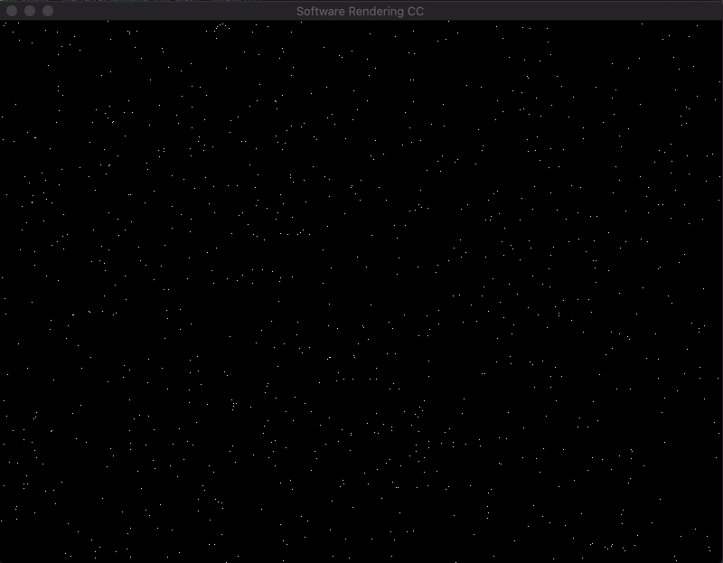

## Star Field C++ & Ada
Simple graphical starfield program comparing C++ and Ada.  This is my third project comparing Ada and C++ and Ada is pretty interesting, but ultimately as has been the case before the C++ version is shorter and simpler. I think maybe for concurrency Ada would be better because Ada's tasking system is very nice, however if you want to write highly concurrent software Go is probably the best option. The things that are cool about Ada like super strong typing and tasking aren't actaully that helpful for graphical applications which is what I'm primarily interested in making. Additionally Ada allows you to define arrays using custom define ranges, however most of the checks on the range (and most of Ada's useful checks) are at runtime, which means you may not see the problem until the app is/has been running, which is strange for a statically typed language

